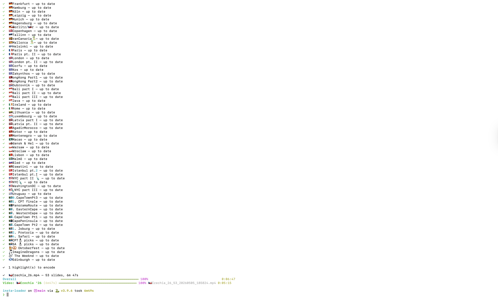
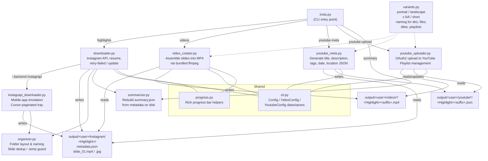

# insta-loader

A command-line tool to back up your own story highlights from Instagram, assemble them into MP4 videos, and optionally upload them to YouTube.

[](https://buymeacoffee.com/pauliejr)

---

## What it does

- **Downloads** story highlights from public Instagram accounts, with resume support
- **Assembles** downloaded slides (images + videos) into a single MP4 per highlight using bundled ffmpeg
- **Uploads** assembled videos to YouTube with auto-generated titles, descriptions, tags, recording date, and location
- Keeps everything in a clean local folder structure you own



---

## Requirements

- Python 3.9+
- No system ffmpeg required — bundled via `imageio-ffmpeg`

```bash
pip install -r requirements.txt
```

---

## Setup

Create a `.env` file in the project root:

```
INSTA_LOGIN_USER=your_instagram_username
# Optional — set the default download backend (instaloader | instagrapi).
# instagrapi requires login but survives the highlights-API soft blocks that
# periodically hit instaloader. Overridable per-run with --backend.
#INSTA_BACKEND=instagrapi
```

On first run you will be prompted for your password. The session is saved to `~/.config/instaloader/` and reused on subsequent runs.

---

## Output structure

```
output/<username>/
  instagram/                 <- downloaded highlight folders
    Travel/
      metadata.json
      Travel_01_20230415_143200.mp4
      Travel_02_20230415_143500.jpg
    summary.json

  videos/                    <- assembled MP4s (portrait, full)
    Travel.mp4
  videos_short/              <- --short
    Travel_short.mp4
  videos_landscape/          <- --landscape
    Travel_landscape.mp4
  videos_landscape_short/    <- --landscape --short
    Travel_landscape_short.mp4

  youtube/                   <- YouTube metadata, one dir per variant
    Travel.json
  youtube_short/
    Travel_short.json
  youtube_landscape/
    Travel_landscape.json
  youtube_landscape_short/
    Travel_landscape_short.json
```

Only the variants you ask for are created — a plain `videos` run produces just `videos/`.

---

## Commands

Run `python3 insta.py --help` or `python3 insta.py <command> --help` for the full reference.

---

### `highlights` — download story highlights

```bash
python3 insta.py highlights <username> [options]
```

| Option | Description |
|---|---|
| `--highlight NAME` | Download only this highlight (partial name, case-insensitive) |
| `--update` | Skip highlights already marked complete; re-download if the source has new slides |
| `--retry-failed` | Only retry highlights that have failed slides |
| `--login-user USER` | Account to authenticate as (or set `INSTA_LOGIN_USER` in `.env`) |
| `--backend {instaloader,instagrapi}` | Download backend (default: `instaloader`). Switch to `instagrapi` if Instagram soft-blocks the highlights API |
| `--output-dir DIR` | Override default output path |

```bash
# Download all (asks for confirmation)
python3 insta.py highlights natgeo

# Only new or incomplete highlights
python3 insta.py highlights natgeo --update

# Re-try previously failed slides only
python3 insta.py highlights natgeo --retry-failed

# Use the instagrapi backend when instaloader gets a "fail" response on highlights
python3 insta.py highlights natgeo --update --backend instagrapi

# Single highlight by partial name
python3 insta.py highlights natgeo --highlight "travel"
```

---

### `videos` — assemble highlights into MP4s

```bash
python3 insta.py videos <username> [options]
```

| Option | Description |
|---|---|
| `--highlight NAME` | Process only this highlight |
| `--update` | Re-encode only highlights newer than their existing video |
| `--image-duration N` | Seconds each image slide is shown (default: 10) |
| `--landscape` | Create 16:9 landscape videos with blurred+darkened background (saved to `videos_landscape/`) |
| `--both-formats` | Create both portrait and landscape videos in one run |
| `--short` | Short variant: cap **static** slides (photo-with-music) at `--max-slide-duration`; real video keeps full length |
| `--all-variants` | Create all four variants: portrait/landscape × full/short |
| `--max-slide-duration N` | Cap for static slides in the short variant (default: 10) |
| `--no-sleep` | Prevent macOS from sleeping during encoding (uses `caffeinate`) |
| `--output-dir DIR` | Override base directory |

```bash
python3 insta.py videos natgeo
python3 insta.py videos natgeo --update

# Portrait + landscape in one pass, keeping the Mac awake
python3 insta.py videos natgeo --both-formats --update --no-sleep
```

Videos are saved to `output/<username>/videos/` (portrait) and `output/<username>/videos_landscape/` (landscape). Failed or interrupted encodes are moved to Trash, not permanently deleted.

---

### `youtube-meta` — generate YouTube metadata

Generates a JSON file per highlight with title, description, tags, recording date, and location.

```bash
python3 insta.py youtube-meta <username> [options]
```

| Option | Description |
|---|---|
| `--highlight NAME` | Process only this highlight |
| `--privacy STATUS` | `unlisted` (default), `private`, or `public` |
| `--landscape` | Generate metadata for landscape videos (reads `videos_landscape/`, writes `youtube_landscape/`) |
| `--both-formats` | Generate metadata for both portrait and landscape videos in one run |
| `--short` | Generate metadata for the short variant (titles get a `· Short` suffix) |
| `--all-variants` | Generate metadata for all four variants |

Titles and tags are auto-generated from folder names — flag emoji detection, camelCase splitting, part numbers, date ranges, country/continent tags.

---

### `youtube-upload` — upload to YouTube

```bash
python3 insta.py youtube-upload <username> [options]
```

| Option | Description |
|---|---|
| `--highlight NAME` | Upload only this highlight |
| `--update` | Delete outdated uploads (after confirmation) and re-upload |
| `--landscape` | Upload landscape videos (reads `youtube_landscape/` metadata, uploads to a separate `· 16:9` playlist) |
| `--both-formats` | Upload both portrait and landscape videos in one run |
| `--short` | Upload the short variant to its own `· Short` playlist |
| `--all-variants` | Upload all four variants, each to its own playlist |
| `--playlist NAME` | Playlist to add videos to (default: `Story Highlights`) |
| `--privacy STATUS` | `unlisted` (default), `private`, or `public` |
| `--client-secrets PATH` | Path to OAuth secrets JSON |

**First-time YouTube setup:**

1. Go to [Google Cloud Console](https://console.cloud.google.com/)
2. Create a project → APIs & Services → Enable **YouTube Data API v3**
3. Credentials → Create OAuth client ID → **User data** (not Public data) → Desktop app
4. OAuth consent screen → Test users → add your Google account email
5. Download the JSON and save to `~/.config/instaloader/youtube_client_secrets.json`

Token is cached at `~/.config/instaloader/youtube_token.json` after first login.

---

### `summary` — regenerate summary

```bash
python3 insta.py summary <username>
```

Reads all `metadata.json` files on disk and rewrites `summary.json`. Useful after manual fixes.

---

## Typical workflow

```bash
# 1. Download new/updated highlights
python3 insta.py highlights natgeo --update

# 2. Retry any failed slides
python3 insta.py highlights natgeo --retry-failed

# 3. Assemble videos (re-encode changed ones only)
python3 insta.py videos natgeo --update

# 4. Generate YouTube metadata
python3 insta.py youtube-meta natgeo

# 5. Upload to YouTube
python3 insta.py youtube-upload natgeo --update
```

### Landscape (16:9) workflow

```bash
# 1. Assemble landscape versions
python3 insta.py videos <username> --landscape --update

# 2. Generate YouTube metadata (titles get · 16:9 suffix)
python3 insta.py youtube-meta <username> --landscape

# 3. Upload to YouTube (separate playlist suffixed with · 16:9)
python3 insta.py youtube-upload <username> --landscape
```

### Both formats at once

`--both-formats` processes portrait and landscape in a single command:

```bash
python3 insta.py videos <username> --both-formats --update --no-sleep
python3 insta.py youtube-meta <username> --both-formats
python3 insta.py youtube-upload <username> --both-formats --update
```

### Short variants

Instagram exports a "photo + music" story as a video file — often 45–60s of a
single still frame. `--short` caps those at 10s while leaving genuine video
untouched, which trims roughly a third off a typical reel.

```bash
python3 insta.py videos <username> --both-formats --short --update
```

`--all-variants` produces all four outputs in one run:

```bash
python3 insta.py videos <username> --all-variants --update --no-sleep
python3 insta.py youtube-meta <username> --all-variants
python3 insta.py youtube-upload <username> --all-variants --update
```

| variant | directory | filename | playlist |
|---|---|---|---|
| portrait full | `videos/` | `Travel.mp4` | `Story Highlights` |
| portrait short | `videos_short/` | `Travel_short.mp4` | `Story Highlights · Short` |
| landscape full | `videos_landscape/` | `Travel_landscape.mp4` | `Story Highlights · 16:9` |
| landscape short | `videos_landscape_short/` | `Travel_landscape_short.mp4` | `Story Highlights · 16:9 · Short` |

---

## Notes

- Only **public** accounts are supported without login. Private accounts require `--login-user`.
- YouTube free quota: ~6 uploads/day unverified, ~100/day after phone verification.
- Add `INSTA_SLEEP=3` to `.env` to pause ~3 seconds between slide downloads if rate-limited. The delay is randomised by ±50% by default to avoid fixed-interval detection patterns. Override the jitter with `INSTA_SLEEP_JITTER=0.3` (0 = no jitter, 1 = ±100%).
- Partial downloads resume automatically — already-downloaded slides are never re-fetched.
- Interrupted downloads leave `.temp` files which are ignored and safely re-downloaded.

---

## Architecture



---

## License

[GNU General Public License v3.0](LICENSE)
